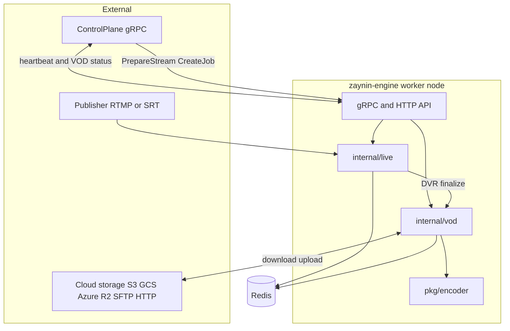
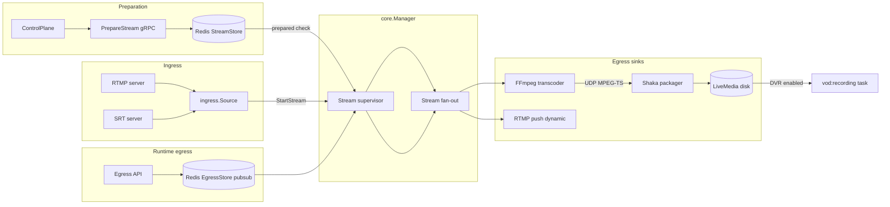
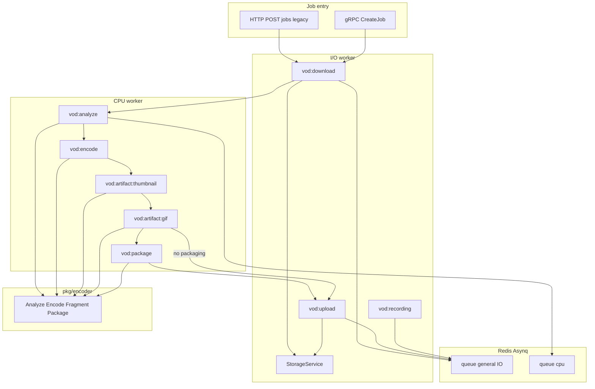

# Zaynin Engine

> This is a study and learning repo. It shows my own journey building media infrastructure, it's not a finished product. Please don't deploy it to production without testing and hardening it yourself first.

This is a distributed media worker node for the Zaynin Engine platform. It handles live stream ingest (RTMP/SRT), real time transcoding, HLS/DASH packaging, and VOD transcoding jobs with cloud storage I/O.

Go module: `github.com/muntader/zaynin-engine`

## About this project

I started building this around **2021** while trying to learn how something like **Wowza** works, basically a self hosted media server that could handle real video workflows. Live streaming ended up being the hard part. VOD encoding came first and was easier to get working.

The first real use case was **[bitbyte3.com](https://bitbyte3.com)**, which is VOD only. The platform needed to take in source files, transcode them into adaptive bitrate packages, then upload them to cloud storage.

I also used this engine on a side project called **[Snapencode](https://snapencode.gumroad.com/l/snapencode)**  a video transcoding and live streaming stack (CMAF/HLS/DASH/RTMP) built from the same ideas as this repo.

In **2024** I updated the codebase with more features: live ingest over **RTMP and SRT**, a stream supervisor, DVR to VOD finalization, and better integration with a control plane. The wider Zaynin Engine ecosystem also has separate tools for ingest proxy routing and multi node distribution, but I'm not sure those are ready for the open source community yet. They're here mostly for reference.

### What it does today

| Area | Stack |
|------|-------|
| **Live streaming** | RTMP + SRT ingest, FFmpeg transcoding, **Shaka Packager** for HLS/DASH |
| **VOD encoding** | FFmpeg transcoding, **Bento4** (`mp4dash` / `mp4hls`) for packaging |
| **Hardware encoding** | Tested on **NVIDIA** GPUs only, CPU encoding works as a fallback |
| **DRM** | Axinom integration was tested in development, but never used in production |

## Features

- **Live**: RTMP and SRT ingest, multi rendition ABR transcoding with FFmpeg, HLS/DASH through Shaka Packager
- **VOD**: download, analyze, encode, generate thumbnails/GIFs, package with Bento4, then upload
- **Encoder library** (`pkg/encoder`): a programmatic API for analysis, encoding, fragmentation, and packaging
- **Cloud storage**: S3, GCS, Azure, R2, SFTP, HTTP, and local paths, all through pure Go SDKs
- **Hardware awareness**: tracks CPU/RAM and NVIDIA GPU/VRAM so it can report load
- **Control plane integration**: gRPC heartbeats, stream assignment, VOD job status reporting
- **Dynamic egress**: you can add RTMP push sinks to a live stream while it's running

## Simple usage

### HTTP endpoints

Base URL: `http://localhost:{http_port}/api/v1` (default `http_port` is **8080**, check your `config.yaml` to confirm).

| Method | Endpoint | Purpose |
|--------|----------|---------|
| `POST` | `/jobs` | Submit a VOD transcoding job (JSON body) |
| `GET` | `/cluster/streams/active` | List active live streams |
| `GET` | `/streams/{streamID}` | Stream details |
| `POST` | `/credentials/{provider}` | Save cloud credentials (`s3`, `gcs`, `azure`, `r2`, `sftp`) |

### Minimal VOD job

Save this as `job.json` and submit it:

```json
{
  "job_label": "Study test job",
  "job_id": "my-job-001",
  "input_storage": {
    "input_id": "source-001",
    "provider": "http",
    "http": { "url": "https://example.com/sample.mp4" }
  },
  "output_storage": {
    "output_id": "dest-001",
    "provider": "s3",
    "s3": {
      "bucket": "my-bucket",
      "key": "encoded/my-job-001",
      "region": "us-east-1"
    }
  },
  "job_settings": { "hardware_acceleration": "auto" },
  "outputs": {
    "streaming_package": {
      "enable": true,
      "video": { "encoder": "h264_nvenc", "renditions": [] },
      "audio": { "mode": "auto" },
      "packaging": {
        "segment_duration_seconds": 4,
        "formats": ["hls", "dash"]
      }
    }
  }
}
```

```bash
curl -X POST http://localhost:8080/api/v1/jobs \
  -H "Content-Type: application/json" \
  -H "X-API-Key: YOUR_API_KEY_FROM_.worker-secrets" \
  -d @job.json
```

HTTP and gRPC APIs require the `X-API-Key` header when a key is configured (auto-generated in `.worker-secrets` on first run). gRPC clients must send the same key as metadata `x-api-key`.

For a full kitchen sink example with DRM, multi audio, subtiltles, and clips, check [`test/vod-job-examples.md`](test/vod-job-examples.md).

### Live streaming

L:ive setup uses gRPC, not HTTP. it's call PrepareStream with a `config_json`. see [`pipeline.json`](pipeline.json) for the structure. once the stream is prepared in redis, publish to:

- **RTMP:** `rtmp://localhost:{rtmp_port}/live/{stream_key}` (default port `1936`)
- **SRT:** `srt://localhost:{srt_port}` (default port `9000`)

you can use [`test/generate_multi_stream.sh`](test/generate_multi_stream.sh) for multiple parallel ffmpeg streams at your rtmpr ingest for testing.

**Live ingest libraries** (pure go):

| Protocol | Library |
|----------|---------|
| RTMP | [github.com/yutopp/go-rtmp](https://github.com/yutopp/go-rtmp) |
| FLV parsing / muxing | [github.com/yutopp/go-flv](https://github.com/yutopp/go-flv) |
| SRT | [github.com/datarhei/gosrt](https://github.com/datarhei/gosrt) |

## Architecture



### Live workflow



1. The control plane calls `PrepareStream` (gRPC), and the config gets stored in Redis (`StreamStore`).
2. A broadcaster connects through RTMP or SRT; `core.Manager` verifies the stream is `prepared` before activating it.
3. The stream supervisor waits for codec/track detection, then fans packets out to sinks. FFmpeg is always attached; Shaka Packager is attached when both transcode and package are enabled. FFmpeg outputs MPEG-TS over dynamic localhost UDP ports to Shaka, which writes HLS/DASH to disk.
4. RTMP push to the sinks can be added at in runtime through b the gRPC/HTTP egress API and Redis pub/sub (`EgressStore`).
5. When the stream ends and dvr is enabled, the supervisor enqueues a `vod:recording` task (HLS rewrite + upload), not the full VOD transcode pipeline.

### VOD workflow

2 async job workers process a chain task workflow backed: a CPU worker (`cpu` queue, concurrency 1) and an I/O worker (`general` queue, concurrency 20). Packaging uses bento4 via `pkg/encoder`(`fragment+ package); shaka packageris live-only.



Task chain: `vod:download` ->  `vod:analyze` ->  `vod:encode` -> `vod:artifact:thumbnail`  -> `vod:artifact:gif` ->  `vod:package` (if enabled) -> `vod:upload` ->  `vod:cleanup` (delayed, currently no-op).

`vod:recording` is a separate shortcut path from live DVR: it rewrites HLS playlists and uploads without analyze/encode steps.

I also moved the Argoworkflow templates here. They used to be split across a few different tools, now they all live in this one repo.

## VOD job reference

VOD jobs are JSON documents accepted by `POST /api/v1/jobs` (HTTP) or `CreateJob` (gRPC). The job json is in [`internal/vod/types/job.go`](internal/vod/types/job.go).

### Pipeline stages

```
Download -> Analyze ->  Encode -> ( Thumbnails + GIFs  ->  (Fragment + Package) -> Upload ->  Cleanup
```

Packaging is will be skip when outputs.streaming_package.enable is false. the humbnails and gig still run when configured, if packaging is disabled the workflow uploads sidecar assets directly after gif generation.

### Top-level keys

| Key | Required | Purpose |
|-----|----------|---------|
| `job_id` | yes | Unique job identifier |
| `job_label` | no | Human-readable label |
| `input_storage` | yes | Source location (exactly one provider) |
| `output_storage` | yes | Destination prefix/path |
| `job_settings` | no | Encoder behavior |
| `outputs` | yes | What to produce |
| `delivery_options` | no | Extra artifacts in the upload bundle |

### `job_settings`

| Key | Values |
|-----|--------|
| `hardware_acceleration` | Drives encoder profile selection: `auto`, `nvidia` / `cuda` / `nvenc`, `intel` / `qsv` / `vaapi`, `amd` / `amf`, or an explicit FFmpeg encoder name (e.g. `h264_nvenc`, `libx264`) |

### Input storage

`input_storage.provider` must be one of: `s3`, `gcs`, `azure`, `r2`, `http`, `sftp`, `local`.

| Provider | Fields |
|----------|--------|
| `s3` | `bucket`, `key`, `region`; optional inline `credentials` |
| `gcs` | `bucket`, `key`; optional inline `credentials` |
| `azure` | `container`, `key` (blob name); optional inline `credentials` |
| `r2` | `bucket`, `key`, `endpoint_url`; optional inline `credentials` |
| `http` | `url` |
| `sftp` | `path`; optional inline `credentials` |
| `local` | `path`  skips download; reads the file in place |

Each block includes `input_id`, used to look up stored credentials when inline `credentials` are omitted.

### Output storage

`output_storage.provider`: `s3`, `gcs`, `azure`, `r2`, `sftp`, `local`, `http`.

| Provider | Fields |
|----------|--------|
| `s3` / `r2` | `bucket`, `key` (upload prefix), `region`; R2 adds `endpoint_url` |
| `gcs` | `bucket`, `key` |
| `azure` | `container`, `key` |
| `sftp` | `path` (remote base directory) |
| `local` | `path` |
| `http` | `url`, optional `token`, optional `headers` map |

Each block includes `output_id` for stored-credential lookup.

### Credentials and keys

Three separate credential mechanisms:

**1. Inline per-job credentials**  optional `credentials` object inside a storage block:

| Provider | JSON keys |
|----------|-----------|
| S3 / R2 | `access_key_id`, `secret_access_key` |
| GCS | `service_account_json` |
| Azure | `sas_token` |
| SFTP | `user`, `host`, `port`, `password` or `private_key` |

**2. Stored cloud credentials (BoltDB)**  register once, reference by `input_id` / `output_id`:

```bash
curl -X POST http://localhost:8080/api/v1/credentials/s3 \
  -H "Content-Type: application/json" \
  -H "X-API-Key: YOUR_API_KEY_FROM_.worker-secrets" \
  -d '{"access_key_id":"...","secret_access_key":"..."}'
```

Supported providers: `s3`, `gcs`, `azure`, `r2`, `sftp`. Also available via gRPC `SaveCredentials`. Persisted in `zaynin-credentials.db`.

**3. Worker secrets**  [`.worker-secrets`](.worker-secrets.example): API key and JWT secret for worker authentication (not cloud I/O).

### `outputs.streaming_package`

| Area | Keys |
|------|------|
| Flags | `enable`, `allow_soft_fail`, `allow_upscale` |
| **Video** | `encoder`, `threads`, `renditions[]` |
| **Audio** | `mode`, `normalization`, `tracks[]` |
| **Subtitles** | `mode`, `tracks[]` |
| **Packaging** | `segment_duration_seconds`, `formats`, `hls_settings`, `drm` |

#### Video renditions

Each `renditions[]` entry supports:

- `height`, `tag`, `encoder`, `preset`, `profile`, `level`, `tune`, `threads`
- `rate_control`: `mode` (`cbr`, `vbr`, `abr`), `bitrate`, `max_bitrate`, `buffer_size`, `qp_value`, `crf_value`
- `filtering.hdr_to_sdr`: `enable`, `tonemap_algorithm`

**Ladder behavior:**

- `renditions: []`  automatic ABR ladder from source resolution down
- Height-only entries  auto bitrates for that rung
- Fully specified entries  custom encoding parameters

#### Audio

`mode`: `copy`, `passthrough`, `custom`, `auto`

| Key | Purpose |
|-----|---------|
| `normalization.enable` | Loudness normalization |
| `normalization.target_lufs` | Target LUFS when normalization is on |
| `tracks[].select.language` | Source language to pick |
| `tracks[].select.channels` | Channel filter |
| `tracks[].output.codec` | Output codec (e.g. `aac`) |
| `tracks[].output.bitrate` | Target bitrate |
| `tracks[].output.label` | Manifest label |
| `tracks[].output.is_default` | Default track flag |
| `tracks[].output.channels` | Output channel count |
| `tracks[].output.sample_rate` | Output sample rate |

#### Subtitles

`mode`: `copy`, `passthrough`, `burn`, `embed`, `custom`, `auto`

| Key | Purpose |
|-----|---------|
| `tracks[].select.language` | Source language |
| `tracks[].select.forced` | Forced subtitle stream |
| `tracks[].action` | `include`, `burn`, `convert_to_vtt`, `burn_in` |
| `tracks[].label` | Manifest label |

#### Packaging

| Key | Values |
|-----|--------|
| `segment_duration_seconds` | Segment length (seconds) |
| `formats` | `hls`, `dash` (processed separately; default in encoder is `cmaf` when empty) |
| `hls_settings.container` | `fmp4` or `ts` |
| `hls_settings.version` | HLS playlist version (≥ 3) |

### `outputs.thumbnails[]`

| Key | Notes |
|-----|-------|
| `enable` | Turn this thumbnail job on/off |
| `id` | Identifier for logging |
| `mode` | `single_image`, `vtt_sprite`, `interval` |
| `timestamps` | Seconds for `single_image` at specific times |
| `interval_seconds` | For `interval` / sprite modes |
| `dimensions.width` / `height` | Output size (0 = derive from aspect) |
| `quality` | JPEG/WebP quality |
| `image_format` | e.g. `jpg`, `webp` |
| `filename_pattern` | Output naming pattern |
| `output_subdir` | Subfolder under `thumbnails/` |
| `allow_soft_fail` | Continue job if this thumbnail task fails |

### `outputs.animated_gifs[]`

| Key | Notes |
|-----|-------|
| `enable` | Turn this GIF job on/off |
| `time_range.start_seconds` | Clip start |
| `time_range.duration_seconds` | Clip length |
| `dimensions` | Output size |
| `frame_rate` | GIF frame rate |
| `output_filename` | Output file name |
| `output_subdir` | Subfolder under `gifs/` |
| `allow_soft_fail` | Continue job on failure |

### `outputs.clips[]` (schema only)

The job schema supports clip extraction (`time_range`, `output_format`, `video_settings`, `audio_settings`), but **no pipeline handler generates clips today**. The upload step reserves a `clips/` directory for future use.

### `delivery_options`

| Key | Purpose |
|-----|---------|
| `keep_source_video` | Include source mezzanine in upload |
| `keep_source_name` | Filename base when keeping source (required if `keep_source_video` is true) |
| `include_job_config` | Include job JSON in output bundle |
| `include_source_analysis_report` | Include ffprobe analysis dump |

### DRM and encryption

Configured under `outputs.streaming_package.packaging.drm`:

| Key | Purpose |
|-----|---------|
| `enable` | Turn DRM on |
| `content_id` | Content identifier (required for Axinom) |
| `provider` | Key provider (`type` + `config`) |
| `dash.systems` | DASH DRM systems |
| `hls.systems` | HLS DRM systems |
| `static_keys` | Optional static key list |

**Provider types** (implemented in `pkg/encoder/media/packager/drm/`):

| `provider.type` | `provider.config` keys | Systems |
|-----------------|------------------------|---------|
| `axinom` | `name`, `signing_key`, `signing_iv` | `WIDEVINE`, `PLAYREADY`, `FAIRPLAY` in `dash.systems` / `hls.systems` |
| `simple_aes` | `kid`, `key` (32 hex chars), `key_uri`, optional `iv` | AES-128 HLS via Bento4 `mp4hls` |

> **Note:** DRM is fully implemented in `pkg/encoder`, but the VOD pipeline step [`fragmentAndPackage`](internal/vod/pipeline/steps.go) does not yet pass `packaging.drm` into the packager. JSON is accepted and documented here; wiring DRM through the pipeline is a small follow-up change.

### Examples

- **Minimal job**  see [Minimal VOD job](#minimal-vod-job) above
- **Advanced job** (DRM, multi-audio, subtitles, thumbnails, GIF)  [`test/vod-job-examples.md`](test/vod-job-examples.md)

## Prerequisites

| Dependency | Purpose |
|------------|---------|
| Go 1.24+ | Build and run |
| Redis | Asynq job queues, stream state, logs |
| FFmpeg + ffprobe | Transcoding and media analysis |
| Shaka Packager | Live HLS/DASH packaging |
| Bento4 | VOD packaging (`mp4fragment`, `mp4dash`, `mp4hls`) |
| NVIDIA GPU (optional) | Hardware encoding and VRAM metrics (only tested on NVIDIA) |

**FFmpeg, Shaka Packager, and Bento4 are not bundled in git.** Install them separately and place them under `tools.bin_dir` (default `./bin`) or on your system `PATH`. See [External tools](#external-tools) below.

## External tools

Packaging binaries are intentionally excluded from the repository (see [`.gitignore`](.gitignore)). A fresh clone is enough to build and run the worker, but **live packaging and VOD packaging jobs need external tools installed**.

### Where the engine looks

All tools are resolved through `tools.bin_dir` in [`config.yaml`](config.example.yaml) (default `./bin`), then system `PATH`:

1. `{bin_dir}/{tool}`  e.g. `./bin/ffmpeg`, `./bin/shaka-packager`
2. `{bin_dir}/bento4/bin/{tool}`  Bento4 SDK layout
3. `{bin_dir}/packager`  when resolving `shaka-packager` (GitHub release artifact name)
4. System `PATH`

On startup the engine logs which tools it found and warns about any that are missing.

### FFmpeg

Install fromp your distro package manager, or copy `ffmpeg` and `ffprobe` into `bin/`:

```bash
# example: copy from a local build or static bundle
cp /usr/bin/ffmpeg /usr/bin/ffprobe ./bin/
```

### Shaka Packager (live streaming)

Download a prebuilt binary from [shaka-packager releases](https://github.com/shaka-project/shaka-packager/releases) (e.g. `packager-linux-x64` on linux). release artifacts are named `packager-*`, but the engine read it asi `shaka-packager`:

```bash
mkdir -p bin
curl -L -o bin/shaka-packager \
  https://github.com/shaka-project/shaka-packager/releases/latest/download/packager-linux-x64
chmod +x bin/shaka-packager
```

Alternatively, place the file as `bin/packager`

### Bento4 (VOD packaging)

Download the SDK from [bento4.com/downloads](https://www.bento4.com/downloads/) or build from [axiomatic-systems/Bento4](https://github.com/axiomatic-systems/Bento4). Extract so the tools live under `bin/bento4/bin/`:

```
bin/
  bento4/
    bin/
      mp4fragment
      mp4dash
      mp4hls
      ...
```

`mp4dash` and `mp4hls` are wrapper scripts that call Python utilities shipped with the SDK. Keep the SDK’s `utils/` and `wrappers/` directories next to those scripts (or install the wrappers to `PATH` per the Bento4 README).

Required for VOD packaging: `mp4fragment`, `mp4dash`, and `mp4hls` (the last is needed for AES-128 HLS jobs).

### Verify installation

```bash
ls bin/ffmpeg bin/ffprobe bin/shaka-packager bin/bento4/bin/mp4fragment
./bin/ffmpeg -version
./bin/shaka-packager --version
```

Then start the engine and check the startup log for `external tool resolved` lines.

## Quick start

```bash
git clone https://github.com/Muntader/zaynin-engine.git
cd zaynin-engine

cp config.example.yaml config.yaml
# edit node.id, control_plane.address

redis-server &

go run .
```

On first run, if `.worker-secrets` doesn't exist yet, the app generates one automatically.

## Configuration

| Key | Description |
|-----|-------------|
| `node.id` | Unique worker identifier (required) |
| `node.type` | `worker`, `origin`, or `edge` |
| `control_plane.address` | Central API gRPC host:port |
| `server.grpc_port` | Worker gRPC API (default `50052`) |
| `server.http_port` | HTTP API (default `8080`) |
| `server.pprof_enabled` | Enable Go pprof (default `false`) |
| `server.media.rtmp_port` | RTMP ingest (default `1936`) |
| `server.media.srt_port` | SRT ingest (default `9000`) |
| `storage.paths.*` | Live media, archive, and VOD workspace directories |
| `tools.bin_dir` | Directory for external binaries (FFmpeg, Shaka Packager, Bento4); see [External tools](#external-tools) |
| `redis.address` | Redis for Asynq and state |

You can override these with environment variables using the prefix `ZAYNIN_` (for example `ZAYNIN_REDIS_ADDRESS`).

## API

**gRPC** (`WorkerService` on `server.grpc_port`) is the main interface for live streaming and advanced use:

| RPC | Purpose |
|-----|---------|
| `CreateJob` | Submit a VOD transcoding job |
| `PrepareStream` | Stage live stream config in Redis |
| `GetStreamDetails` / `ForceStopStream` | Live stream control |
| `AddRtmpPushSink` / `StopSink` | Dynamic egress |
| `SaveCredentials` | Store cloud credentials (BoltDB) |
| `GetSystemStatus` / `GetLogs` | Monitoring |

See [`proto/workerpb.proto`](proto/workerpb.proto) for the full schema.

**HTTP** on `server.http_port` is still running but it's considered legacy for new integrations. Submitting VOD jobs through `POST /api/v1/jobs` is the main reason to still use it.

## Development and testing

| Asset | Description |
|-------|-------------|
| [`docs/GAP_ANALYSIS.md`](docs/GAP_ANALYSIS.md) | Production gaps, unwired features, prioritized hardening list |
| [`test/job_test.sh`](test/job_test.sh) | Batch submit VOD jobs from a list of URLs |
| [`test/generate_multi_stream.sh`](test/generate_multi_stream.sh) | Parallel RTMP load test using FFmpeg |
| [`test/vod-job-examples.md`](test/vod-job-examples.md) | Full VOD JSON reference (DRM, multi audio, etc.) |
| [`test/credentials.http`](test/credentials.http) | HTTP examples for saving cloud credentials used on jetbrains for http testing  |
| [`test/job_simple.http`](test/job_simple.http) | Simple job request examples .. |
| [`test/job_advanced.http`](test/job_advanced.http) | Advanced job request examples .. |
| [`pipeline.json`](pipeline.json) | Sample live stream pipeline config |

```bash
go build ./...
```

## Security

**Never commit secrets.** This repo uses:

- [`.gitignore`](.gitignore), which excludes `.worker-secrets`, `config.yaml`, `zaynin-credentials.db`, and `storage/`
- [`.worker-secrets.example`](.worker-secrets.example), a template for the API key and JWT secret
- [`config.example.yaml`](config.example.yaml), a template for node config

If any credentials were ever committed, rotate them in your cloud console. Purging them from git history does not invalidate keys that already leaked.

## Project layout

```
main.go                 Entry point, service wiring
internal/live/          RTMP/SRT ingest, stream manager, FFmpeg transcoder, Shaka packager
internal/vod/           VOD pipeline, storage I/O, job types
internal/api/           gRPC and HTTP servers
internal/common/        Control plane client, logging, config types
internal/hardware/      CPU/GPU resource monitoring
pkg/encoder/            Reusable encoding/packaging library (Bento4 for VOD)
proto/                  gRPC service definitions
test/                   Scripts, HTTP examples, and JSON references
```

## License

License TBD.

---

> This repository is shared for study and learning. It grew out of a personal project to understand how media servers work. Use it as a reference, try it locally, and do your own hardening before relying on it for anything real.